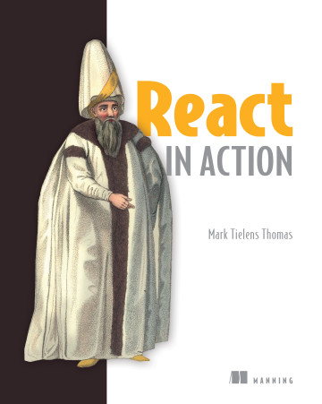

# 《React实战》

  
Manning出版社的[在线电子书](https://livebook.manning.com/book/react-in-action/part-1/)，可以免费学习  
书中使用的React版本是v16.0.0，可以结合[在线文档](https://reactjs.org/docs/getting-started.html)同时学习v18.0.0  
作者提供的在线练习地址:[https://codesandbox.io/](https://codesandbox.io/s/react-in-action-2-2-forked-du03hd?file=/index.html)  

下面让我们开始准备开发环境吧  

这里首先声明我的开发环境配置：  

- Windows 10  Enterprise 20H2  
- Visual Studio Code 1.66.2  
- NVM@1.1.9  
- NodeJS@16.13.2  
- NPM@8.5.0  
- NRM@1.2.5  
- react@18.0.0  
- create-react-app@5.0.1  

## Node.js的安装与管理

nvm全英文也叫node.js version management，是一个nodejs的版本管理工具。  
[nvm Windows Release](https://github.com/coreybutler/nvm-windows/releases)  
[nvm-sh](https://github.com/nvm-sh/nvm)  

这里使用的是nvm Windows  

安装NVM之前，务必卸载已经安装的Node  

> nvm v  
> nvm list available  
> nvm install [nodejs version-no]  
> nvm ls  
> nvm use [nodejs version-no]  
> node -v  
> npm -v  

配置环境变量：  

> NVM_HOME = D:\Programs\nvm  
> NVM_SYMLINK = D:\Programs\nodejs  
> NODE_HOME = %NVM_HOME%\v16.13.2  

nvm常见问题  
如果下载node过慢，请更换国内镜像源:  
在 nvm 的安装路径下，找到 settings.txt，  
设置node_mirro与npm_mirror为国内镜像地址。  

> root: D:\Programs\nvm  
> path: D:\Programs\nodejs  
> node_mirror: [https://npm.taobao.org/mirrors/node/]  
> npm_mirror: [https://npm.taobao.org/mirrors/npm/]  

## npm的安装与管理

先修改全局模块的安装路径及缓存路径(如果前面已经设置过环境变量)  
1、在nvm目录下新建两个文件夹，node_cache和node_global  
2、在cmd中执行npm config set prefix "nodeglobal路径"，和npm config set cache "node_cache路径"。  
3、新建系统环境变量NODE_PATH，变量值是你新建的node_global文件下的node_modules  
4、更新系统环境变量PATH，将Path变量中相应的npm的值改为你的node_global的路径  
5、需要重启已打开的命令行窗口，以使更改生效  

> npm config set prefix "D:\Programs\nvm\node_global"  
> npm config set cache "D:\Programs\nvm\node_cache"  
> NODE_PATH = D:\Programs\nodejs\node_global\node_modules  
> PATH添加 %NVM_HOME%,%NVM_SYMLINK%,%NODE_PATH%  

nrm(npm registry manager)是npm的镜像源管理工具，有时候国外资源太慢，使用这个就可以快速地在npm源间切换  

> npm install -g nrm  
> nrm -V  
> nrm ls  
> nrm test  
> nrm use [repository_morror]  
> npm install -g create-react-app  
> cd D:\react-in-action\ch00  
> create-react-app demo  
> cd demo  
> npm start  
> Ctrl+C退出当前会话  

在demo项目下的package.json文件中，有配置当前使用的react的版本号  
在命令行查看最新的版本  

> npm info react  //查看最新版本  
> npm install --save react@18.0.0  //安装指定版本  
> npm info create-react-app  //查看最新版本  
> create-react-app -V  

如果要安装最新版的create-react-app，必须先卸载之前的版本  

Create React App是基于Webpack开发的。Webpack是一个处理Javascript，CSS，HTML和图像文件的打包工具  
但是Create React App并不是使用React的必要条件，它只是包装了Webpack(及其他一些工具)，使其易于入门  

> npm uninstall -g create-react-app  

如果卸载失败，可以手动删除对应的文件和对应文件夹，并运行以下命令确认是否删除成功  
\node_global\create-react-app,  
\node_global\create-react-app.cmd,  
\node_global\create-react-app.ps1,  
\node_global\node_modules\create-react-app\\*,  
\node_global\node_modules\create-react-app  

> create-react-app -V  
> npm install -g create-react-app  
> npx create-react-app demo-x  
> cd demo-x  
> npm start  
> Ctrl+C退出当前会话  

如果你成功了，请一定要跟我分享你的喜悦哦~  
demo的源码放在ch01_intro目录下  
