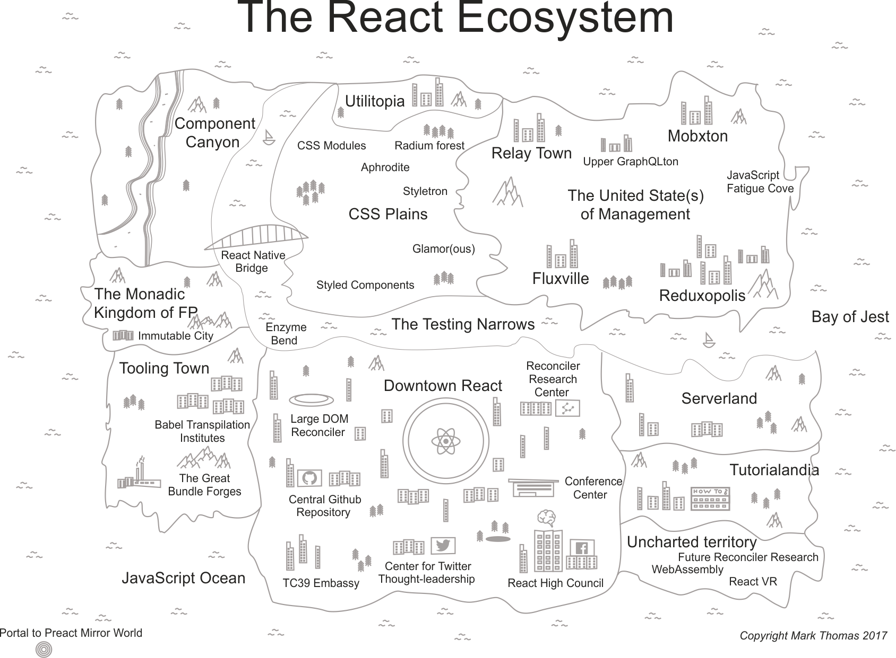
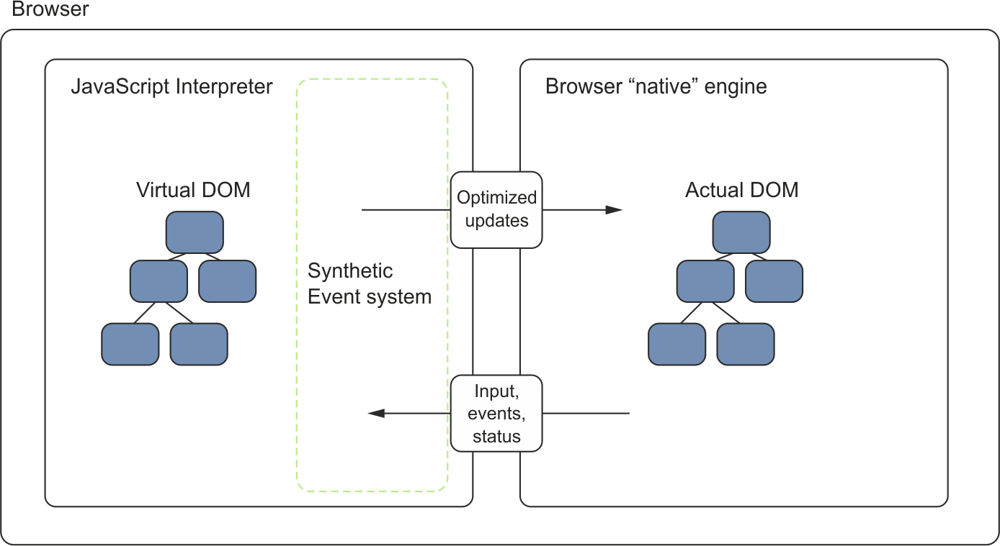
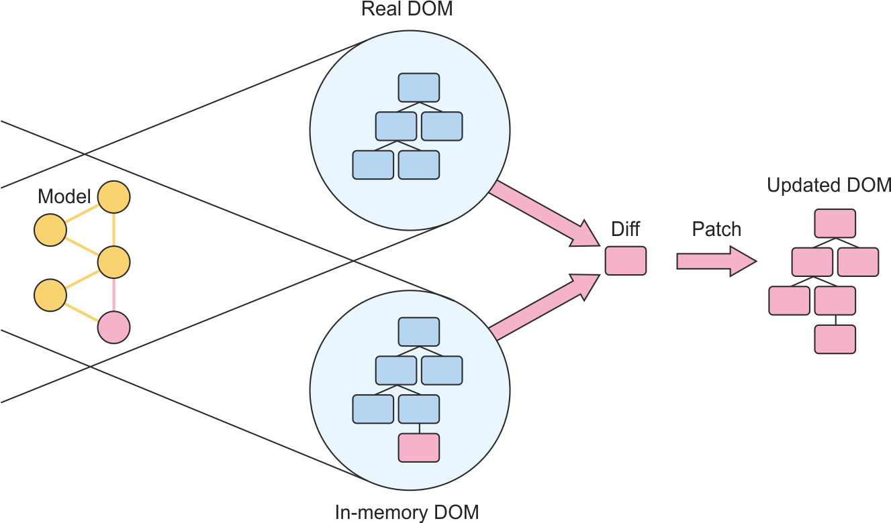
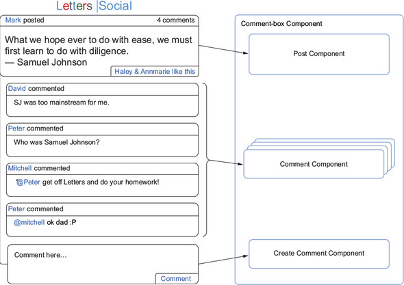

# 初识React

组成：

- 组件  
- React库  
- 第三方库  
- 运行React应用  

React生态系统
  

Angular是一个大而全的全能战士，而React则是专注于UI的视图方面  

## 虚拟DOM

DOM和虚拟DOM  
  
React的对比和更新流程  
  

## 组件概览

组件，是React的基本单元  

本书中的一个组件分解示例：  

  
